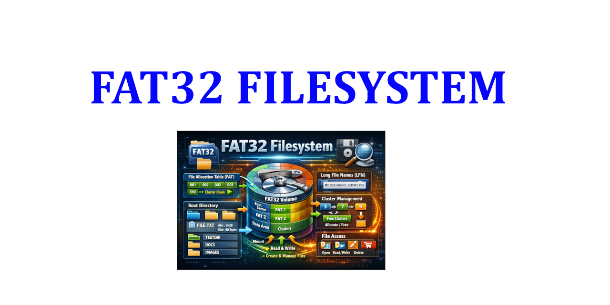

[](https://github.com/baponkar/fat32_fs)




# FAT32 Filesystem

## Description
---
This repository will help to create FAT32 Filesystem and test that filesystem in raw disk image.

This repo has following support

✅ GPT Partition Support

✅ 8.3 File/Directory Name Support

✅ Long File/Directory Name support

✅ Successfull test functions


Here disk inpot/output is using following two functions

```
bool disk_read(uint64_t lba, uint32_t count, void* buffer);
bool disk_write(uint64_t lba, uint32_t count, const void* buffer)
```


To build the project

```
make -B
```

To make a raw disk image
```
make disk
```

To test
```
make test
```

---
Check the Disk and test Disk Content:

```bash
# Creating a Blank Disk Image of size 1024 bytes i.e. 1 GB
dd if=/dev/zero of=disk_img/disk.img bs=1M count=1024

# Check GPT Partition
gdisk -l disk_img/disk.img

# Creating a loop device for disk.img on first available loopdevice
sudo losetup -fP --show disk_img/disk.img 

# if giving output
/dev/loop0

# Check FAT Partition 
sudo fsck.fat -v -n /dev/loop0p1

# Mount first partition of loop device on mnt dir
sudo mount /dev/loop0p1 disk_img/mnt 

# List root mnt directory
ls -R disk_img/mnt

# Check mylongtestfile.text content
cat disk_img/mnt/mylongtestdir/mylongtestfile.text

# More Debug functions

# Check MBR LBA0
hexdump -C -n 512 disk_img/disk.img

# Check GPT Header LAA1
hexdump -C -s 512 -n 92 disk_img/disk.img

# Check GPT Partition Table LBA2
hexdump -C -s 1024 -n 512 disk_img/disk.img

# Unmount the disk.img
sudo umount disk_img/mnt

# Remove specific loop device
sudo losetup -d /dev/loop0

# Remove all loop device
sudo losetup -D

# Verify by see all loop device
losetup -a

```

We can also inspect the disk.img by GUI interface by using following:
1. [WinImage](https://winimage.com/download.htm)
2. [OSFMount](https://www.osforensics.com/tools/mount-disk-images.html)

Reference:

1. [wiki.osdev.org](https://wiki.osdev.org/FAT)


---
© 2026 baponkar. All rights reserved.


